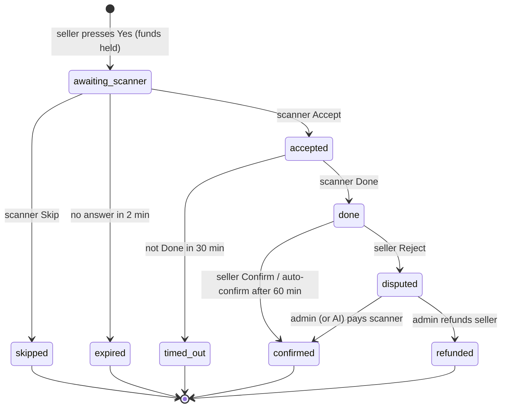

# Architecture

## 1. Processes

```
                    ┌────────────────────────────── one VPS (docker compose) ──────────────────────────────┐
 Telegram ◄──────►  │  bot  (python -m app.bot.main)                                                        │
 users              │    • python-telegram-bot, long polling, handlers per role                             │
                    │    • background worker: timers · outbox delivery · chain watcher · payouts ·          │
                    │      Binance claims · AI verification · heartbeat                                     │
                    │                                   │                                                   │
 Admin browser ◄──► │  web (Caddy: TLS, static panel) ──► api (uvicorn app.api.main)   ──────►  db (PostgreSQL 16)
                    │                                   FastAPI, cookie auth, 2FA, audit        ▲           │
                    └───────────────────────────────────────────────────────────────────────────┼───────────┘
                         BNB Smart Chain RPC ◄── bot (reads logs, sends payouts) ─────────────────┘
                         Binance API (optional) · Anthropic API (optional)
```

* **There is no message broker.** Everything that has to happen later (expiry, reminders, auto-confirm, proof deadlines, message delivery) is a **row with a due time** in PostgreSQL. The worker loops poll those rows
  (every 1-20 s) and process each item in its **own transaction**, so a crash, restart or a second run is harmless: the work is idempotent and the database is the single source of truth.
* The **API** and the **bot** share the same code (`app/services`, `app/models.py`) and the same database; they never call each other.
* The database is any PostgreSQL 14+: the `db` container by default, or a hosted one such as **Supabase** ([SUPABASE.md](SUPABASE.md)). In the hosted layout the `db` box above is external, all tables live in a dedicated schema
  (`DB_SCHEMA`, pinned as the connection's `search_path`), the processes connect through the provider's session pooler with small pools, and Row Level Security is switched on for every table.
* Run **exactly one bot process** (long polling allows only one consumer per token). The API is single-process too (its login rate limiter is in memory); put a second API behind a shared limiter before scaling out.

## 2. Repository map

```
backend/app/
  config.py        environment-driven process settings (secrets, URLs, chain)        settings_service.py = admin-editable business rules (DB)
  models.py        all tables, constraints                                           enums.py / states.py / callbacks.py  shared constants
  db.py            async engine (pool, schema pinning), session_scope()              money.py     Decimal helpers          timeutil.py  zones, slots, countries
  dbtools.py       hosted-database hygiene: schema creation, Row Level Security, exposure checks, URL helpers
  services/        business logic - no Telegram, no HTTP
     users.py slots.py matching.py sessions.py settlement.py disputes.py wallet.py payments.py outbox.py scheduler.py urls.py proofs.py ai_verify.py qr.py
  chain/           hd.py (BIP-44 addresses) bsc.py (RPC) watcher.py payout.py sweeper.py binance.py
  bot/             main.py (handler registration) worker.py (loops) delivery.py (outbox → Telegram) context.py handlers/{start,scanner,seller,wallet,admin,common,router}.py
  api/             main.py (app, headers, static) security.py (argon2, JWT, TOTP, limiter) deps.py routers/{auth,users,transactions,wallets,reports,settings,dashboard}.py
  texts.py         every user-facing message (English)      cli.py  operations CLI       demo.py  demo data
backend/migrations/   Alembic (single baseline migration 0001)       backend/tests/   pytest suite
frontend/src/     app/ (one folder per page) · components/ · lib/ (api client, types, formatters)      frontend/public/tz.html  Mini App
deploy/           docker-compose.yml · Caddyfile · web.Dockerfile · .env.example · install/update/backup/restore scripts · systemd/
```

Handlers follow one pattern: *do the database work inside `session_scope()`, return `Reply` objects, send them after the transaction committed.* A Telegram error can therefore never roll back business state.

## 3. Data model

| Table | Purpose |
|---|---|
| `users` | one row per Telegram user: role, status (`onboarding → pending → approved / rejected / suspended`), country, IANA time zone, alias (`user1`), reputation, conversation state (`state`, `state_data`, `state_expires_at`) |
| `scanner_slots` | a scanner's daily windows as **local wall-clock hours + the IANA zone** (`slot_start`, `slot_end`, `timezone`), `is_active`, mirrored name/reputation |
| `slot_notifications` | which pre-slot reminders were sent / answered (Ready / Busy) per occurrence |
| `sessions` | one task: seller, scanner, URL, amount, commission, slot, status, and the due times `expires_at`, `deadline_at`, `prompt_at`, `prompted_at` |
| `transaction_history` | immutable record of a decided task (names, countries, time zones **at that time**, URL, amounts, status) - what Reports and CSV read |
| `disputes` | seller rejection: reason, proof file, AI verdict, admin decision/notes |
| `wallets` | `balance`, `pending` (held), lifetime totals, saved payout addresses |
| `ledger_entries` | append-only money movements (wallet or platform) with balances after; the audit trail for every number |
| `deposit_addresses`, `deposits`, `withdrawals` | per-seller BSC address; deposits (on-chain or Binance claims, unique `(method, tx_hash, log_index)`); withdrawals with fee and status |
| `outbox` | messages to send to Telegram (transactional outbox), with dedupe key, lease, retries |
| `broadcasts` | admin announcements (per-user delivery rows live in `outbox`) |
| `settings`, `kv_state` | admin-editable settings (typed, validated) and small runtime state (worker heartbeat, chain cursor) |
| `admins`, `audit_log` | panel accounts (Argon2 hash, TOTP secret encrypted, lockout counters) and an audit trail of every admin action |

All timestamps are `timestamptz` in **UTC**; money is `NUMERIC(20,8)` ↔ `Decimal`. Check constraints mirror the enums so impossible states cannot be stored.

## 4. The task state machine



* `skipped`, `expired`, `timed_out`: the held funds are **released**, nothing is charged, reputation changes by the configured amounts.
* `confirmed`: held funds are **consumed** - scanner gets the reward, the platform the commission.
* Every transition is a **compare-and-set under row locks** with a fixed lock order (*session → scanner user → wallets*), so two simultaneous clicks, a timer firing at the same moment, or an admin decision racing an auto-confirm can never double-pay.
* The timers (`expires_at`, `deadline_at`, `prompt_at`, `prompted_at`) are columns on the session. `scheduler.tick_sessions` lists the due sessions and then handles each one in its own transaction under the session's row lock, re-checking the state first - so a timer racing a user's click is decided exactly once. The outbox and conversation-expiry loops additionally use `FOR UPDATE SKIP LOCKED`.

### Matching

When a seller has sent a valid URL the bot picks **one** scanner: approved · has a name · has an *active* slot **right now** (computed in UTC from the local window and the scanner's zone, DST-aware, wrap-around windows like 22-00 supported) · did not press *Busy* for this occurrence · is under the concurrency limit.
Ranked by **reputation (high first)**, then **least recently assigned**. The seller sees only the chosen name and confirms; if the situation changed in between, they are asked again with the new name. There is no backup scanner: skip / expiry ends the attempt.

## 5. Money

* Hold / release / pay are ledger postings (`services/settlement.py`) executed inside the same transaction as the state change; wallets use `SELECT … FOR UPDATE` and a `CHECK (balance >= 0 AND pending >= 0)`.
* `python -m app.cli reconcile` verifies wallets against ledger sums, global conservation (all non-adjustment entries = credited deposits − completed payouts) and users + platform = ledger total. Tests assert it after every scenario.
* Deposits: `chain/watcher.py` keeps a block cursor, reads `Transfer` logs addressed to known deposit addresses **only up to `head − confirmations`**, and credits idempotently.
* Withdrawals: *lock → admin approve → (manual mark-paid | automatic payout) → complete*; automatic payouts commit `processing` before broadcasting and never re-send an ambiguous attempt. Details: [PAYMENTS.md](PAYMENTS.md).

## 6. Anonymity

`app/texts.py` documents the rule and the tests enforce it: messages to a seller contain the scanner's alias only; messages to a scanner contain nothing about the seller. `test_bot_e2e.py` runs full journeys and asserts that no real name, username,
ID, country or time zone of one side ever appears in anything the other side receives. The admin panel is the only place that joins both identities.

## 7. Time zones

Telegram does not give bots a user's time zone or country. The bot opens the **Mini App** `/tz.html`, which reads `Intl.DateTimeFormat().resolvedOptions().timeZone` and `navigator.languages` and sends them back; the bot proposes a country
(derived from the zone and the language hints) and the user confirms or picks/ types another one. Slots are stored as *local hours + IANA zone* and converted to UTC **at the moment of use**, so daylight-saving changes need no data migration. Admin-side everything is UTC.

## 8. Messaging (outbox)

Every message to another person is first written to `outbox` in the **same transaction** as the change that caused it (with a dedupe key), and delivered by the worker: leased rows, retry with back-off, rate limiting (~25 messages/s),
`Forbidden` → the user is marked `bot_blocked`, HTML parse errors → resent as plain text, link previews off. A crash between "state changed" and "message sent" is therefore impossible to lose. A housekeeping loop (every 6 h) deletes delivered / given-up messages and old slot reminders after 30 days so the table stays small; broadcast deliveries, money, tasks, disputes and the audit log are never deleted.

## 9. Security model

| Area | Measures |
|---|---|
| Panel authentication | Argon2id passwords (≥ 12 chars, mixed, must not contain the username); JWT in an `HttpOnly`, `Secure`, `SameSite=Strict` cookie; token versioning (password change signs out everything); lockout after 5 failures / 15 min; per-IP limiter; optional **TOTP 2FA** (secret encrypted with a key derived from `SECRET_KEY`, replay protection) |
| Web hygiene | CSRF header required on every unsafe method; strict CSP (`default-src 'self'`), `X-Frame-Options: DENY`; the time-zone Mini App page (same origin, loads telegram.org's script) may be framed by Telegram only and has `connect-src 'none'`, so a compromised script there cannot reach the admin API, HSTS from Caddy, API docs disabled in production, proof images only for logged-in admins, CSV formula-injection guard |
| Authorisation | all admin endpoints require a valid session; Telegram admin buttons check `ADMIN_TELEGRAM_IDS` |
| Secrets | environment only (`deploy/.env`, mode 600); `SECRET_KEY` validated on start in production; HD wallet is **watch-only** by default; Binance key must be read-only (checked) |
| Input | URLs are strictly validated (https, allow-listed domains); screenshots are decoded and re-encoded with Pillow (EXIF stripped, size/pixel limits); user text is HTML-escaped in every message; bot rate limiter per user |
| AI | screenshots only, instructions inside images are ignored, structured output, low confidence escalates to a human, refunds never automatic by default |
| Money | decimals only, row locks, CHECK constraints, idempotent crediting, append-only ledger, audit log, reconcile |
| Hosted database (Supabase) | dedicated schema that is never exposed over the provider's HTTP API, Row Level Security on every table (the owning role is exempt), SSL, optional certificate verification; `python -m app.cli check` verifies the exposure ([SUPABASE.md](SUPABASE.md#3-what-keeps-the-data-private)) |

## 10. Testing

`backend/tests` (264 tests, real PostgreSQL - the whole suite also runs inside a dedicated schema in CI): unit tests for time and money logic; state-machine and concurrency tests (two sellers racing for one scanner, double-confirm pays once, accept racing the expiry timer); chain tests against an in-memory EVM with a real ERC-20 contract;
a **simulated Telegram** that runs the real `python-telegram-bot` application with an injected transport for end-to-end journeys; API tests for every endpoint including authentication, 2FA, CSRF and lockout.
The panel is type-checked and built in CI; its screens and write flows were verified manually in a headless browser (Playwright) against seeded demo data, but there is no automated browser test suite in the repository.

## 11. Known limitations and assumptions

* **Binance** verification follows Binance's documented API but was never run against a live account; unknown shapes fall back to manual confirmation.
* **The AI check** (Anthropic API) is optional and was exercised with a fake client in tests and by code review of the request format, not against the live service.
* **Commission** is charged to the sender on top of the reward (a design decision; see PAYMENTS.md to change it). Auto-confirm after 60 minutes of seller silence is a default that the admin can change or disable.
* **Dependency audit** (run on the pinned versions): `npm audit` reports 0 vulnerabilities. `pip-audit` reports python-ecdsa (CVE-2024-23342, a timing attack on **P-256** signing, no upstream fix) as a transitive dependency of `bip-utils`. This project only uses secp256k1, which bip-utils serves through `coincurve`, and never signs anything with python-ecdsa, so the issue is not reachable. Re-run both audits before every release.
* **Supabase mode**: the schema handling, Row Level Security, role privileges, dump / restore and connection-URL logic are tested against a local PostgreSQL with simulated Supabase roles, and CI runs the Docker stack against a plain PostgreSQL outside the stack; nothing has been run against a real Supabase project.
* Telegram long polling, one bot process. Webhook mode and horizontal scaling are not implemented.
* English only (all text in `app/texts.py`, easy to translate).
* Operating this service legally and within the terms of the involved platforms is the operator's responsibility.
